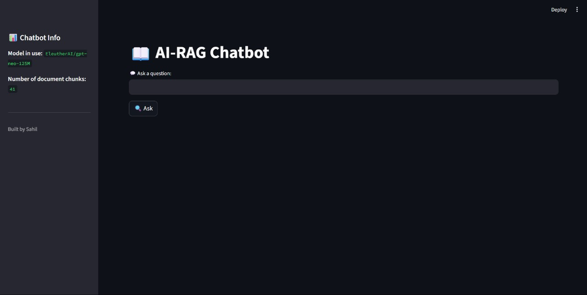

# 📖 AI-Powered RAG Chatbot 

This project implements a **Retrieval-Augmented Generation (RAG)** chatbot using **GPT-Neo 125M** to answer natural language queries based on a user agreement document.

---

## 📑 Project Architecture & Flow

**Components:**
- `embed_and_store.py` — Converts document chunks into sentence embeddings and saves a FAISS index.
- `retriever.py` — Retrieves top-k relevant context chunks using vector similarity search.
- `generator.py` — Generates a final answer by combining retrieved chunks and query using a text generation model.
- `rag_pipeline.py` — Connects retriever and generator into a single chatbot pipeline.
- `app.py` — Streamlit frontend for interactive chat interface.

**Flow:**
1. Input query via Streamlit app.
2. RAG pipeline retrieves top-3 relevant document chunks.
3. Chunks + query are passed to GPT-Neo 125M text generator.
4. Model generates a contextual, fluent answer.
5. Display answer and source chunks interactively.

---

## 📦 Setup Instructions

### 1️⃣ Install dependencies:
```bash
pip install -r requirements.txt
```
## 2️⃣ Preprocess document and create embeddings:
- Place your text chunk in `chunks/` folder.
- Run:
```bash
python src/embed_and_store.py
```
✔️ This builds a `vectordb/document_index.faiss` vector store.

## 📌 Model and Embedding Choices
| Component       | Choice                                   | Reason                              |
| :-------------- | :--------------------------------------- | :---------------------------------- |
| Embeddings      | `sentence-transformers/all-MiniLM-L6-v2` | Fast, lightweight, solid accuracy   |
| Generator Model | `EleutherAI/gpt-neo-125M`                | 2048 token context, faster on CPU   |
| Retriever       | `FAISS`                                  | Fast dense vector similarity search |

## ▶️ Running the Chatbot
### 3️⃣ Launch Streamlit app:
```bash
streamlit run app.py
```
✔️ View generated answer and supporting context passages

## 💬 Streaming Response Support
👉 The current build does not use streaming token-by-token output in Streamlit — for simplicity and speed on CPU.

For token streaming:
- Replace `pipeline("text-generation")` with a `generate()` loop
- Stream tokens via `st.empty()` and `placeholder.text()` updates

## 💡 Sample Queries
```bash
"What is the refund policy?"
"What are the termination conditions?"
"Is user data shared with third parties?"
```
Sample Output Screenshot:


## 📺 Demo Video
👉 [Watch project demo here](https://drive.google.com/file/d/1GDCuwrr2BGQg4-NTokgZ2lRUJga5bTKk/view?usp=sharing)
